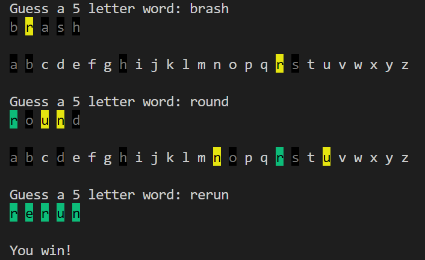

# Wordle
A simple implementation of wordle in the python terminal

Highlighted text is used to display which letters are exact matches to the answer (green), elsewhere in the answer (yellow) or not in the answer (black) and the current state of the alphabet:

